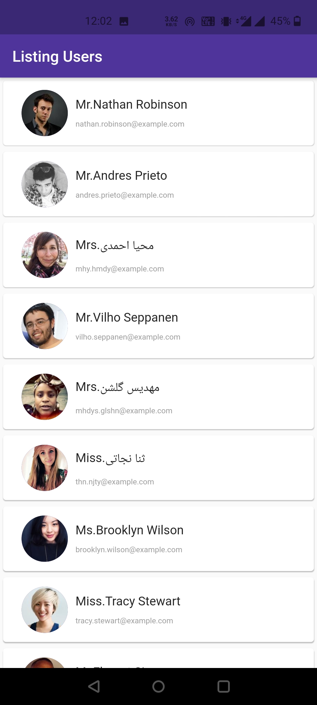

# Random user 
This is a sample  Flutter application which generates random users after fetching them through an random user API. This app is built using MVP architecture.

## Technologies Used
- <a href="https://randomuser.me/api/">Random user api</a>

## Screenshots

## How to run this
Running this is as simple as it gets. Follow this steps

- Open your terminal (NOTE: git bash prefered/ Terminal on VS Code)
- Navigate to the project folder where you have cloned this repo.
- Open an emulator or plug in a real device
- Type the following command in the terminal

       flutter run

## Getting Started

This project is a starting point for a Flutter application.

A few resources to get you started if this is your first Flutter project:

- [Lab: Write your first Flutter app](https://flutter.dev/docs/get-started/codelab)
- [Cookbook: Useful Flutter samples](https://flutter.dev/docs/cookbook)

For help getting started with Flutter, view our
[online documentation](https://flutter.dev/docs), which offers tutorials,
samples, guidance on mobile development, and a full API reference.
